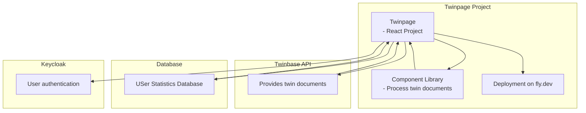

# TWINPAGE
## DESCRIPTION OF TWINPAGE
A new concept called “digital twin” intends to close the information gap between the physical and digital world. Twinbase uses digital twin description documents to combine data and services from several systems into one digital twin entity (a twin document). The project Twinpage will help Twinbase visualize the twin documents to the users. Twinpage makes it easier to understand the contents of a twin document by structuring the twin document into an easy to read format.
- Currently running at https://twinpagedev.fly.dev/

## ARCHITECTURE SCHEMATIC



# COMPONENT LIBRARY
This is a React component library for displaying digital twin information. Library is based on the tutorial at https://dev.to/alexeagleson/how-to-create-and-publish-a-react-component-library-2oe

## CONTRIBUTING

- Clone the repository
- Create a new branch
- Install packages ```npm install```
- Add a folder in the folder "src/components". Add your component and file "index.ts" in the folder you just created. Then export your component in both of the "index.ts" files. The other one is located in "src".
- To test your component locally make a "story" under the folder "src/stories" and then run ```npm run storybook```
- For making stories, you can follow the existing stories and look more information in https://storybook.js.org/docs/writing-stories
 - Create pull request after making sure the code works
